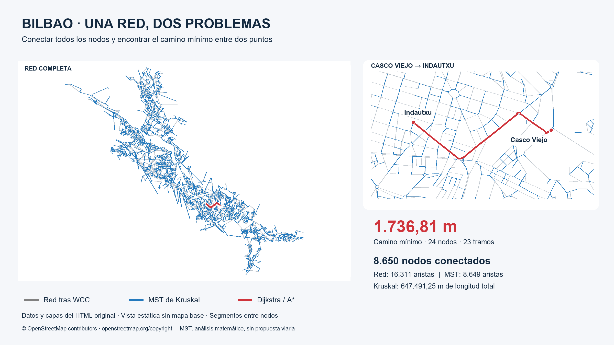
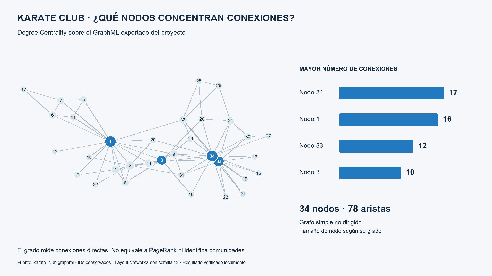

# Graph Modeling & Graph Algorithms with Neo4j GDS

**De redes sociales y de citación al análisis de la red urbana de Bilbao.** Proyecto práctico de formación en Data Engineering e Inteligencia Artificial, realizado por [Ander Josu Garigorta Barba](https://github.com/Ander-Josu).

El trabajo explora cómo la dirección, los pesos y la conectividad de un grafo condicionan sus algoritmos. Combina análisis con Neo4j Graph Data Science, implementaciones en Python y visualización geoespacial. El caso principal compara dos preguntas: **¿cuál es el camino mínimo entre dos puntos?** y **¿cómo conectar todos los nodos con el menor coste total?**



La red tras seleccionar su componente principal aparece en gris, el Minimum Spanning Tree de Kruskal en azul y el camino Casco Viejo–Indautxu en rojo. La imagen se genera con las coordenadas y capas del HTML original: es una vista estática sin mapa base, con un detalle ampliado de la ruta. Los segmentos unen nodos y simplifican la geometría de las calles.

## Tecnologías

Python · Neo4j Desktop · Graph Data Science (GDS) · NetworkX · Folium · PyVis · Matplotlib · Pillow.

## Datasets y recorrido del trabajo

| Dataset | Tamaño trabajado | Técnicas |
|---|---:|---|
| Zachary Karate Club | 34 nodos / 78 aristas originales | Degree Centrality, PageRank, Louvain |
| Cora Citation Network | 2.708 nodos / 5.429 relaciones | PageRank, WCC, SCC |
| LastFM | 19.914 nodos / 584.060 relaciones proyectadas | Node Similarity, FastRP, KNN |
| Red urbana de Bilbao | 8.746 nodos / 16.429 aristas originales | WCC, BFS, DFS, Dijkstra, A*, estrategias de búsqueda, Kruskal |

Karate Club, Cora y LastFM se cargan mediante los [loaders del cliente GDS](https://neo4j.com/docs/graph-data-science-client/current/common-datasets/). LastFM se carga no dirigido por defecto: el recuento de la proyección no debe confundirse con relaciones únicas de origen. Cora contiene `Paper` y `CITES`; LastFM contiene `Artist`, `User`, `TAGGED`, `IS_FRIEND` y `LISTEN_TO`.

Bilbao se conserva como `MultiDiGraph` en `parte2_bilbao/bilbao-3974.graphml`: admite dirección y aristas paralelas. Los nodos incluyen coordenadas `x/y` y propiedades viales; las aristas incluyen `length`, tipo de vía, sentido, geometría y pendiente. La carga actual en Neo4j selecciona un subconjunto de estas propiedades.

## Bilbao: del grafo original a los resultados

1. **Inspección:** 8.746 nodos y 16.429 aristas.
2. **WCC:** 38 componentes; selección del mayor, con 8.650 nodos y 16.311 aristas. Quedan fuera 96 nodos.
3. **Exploración:** BFS y DFS desde Casco Viejo hasta Indautxu.
4. **Camino mínimo:** Dijkstra y A*, con `length` como coste.
5. **Comparación didáctica:** cuatro estrategias sobre un subgrafo de 70 nodos y 107 aristas.
6. **Conectividad mínima:** transformación a grafo simple no dirigido y MST de Kruskal.

| Análisis | Resultado | Evidencia |
|---|---|---|
| Componente principal | 8.650 nodos / 16.311 aristas | Recalculado desde el GraphML |
| BFS | 710 nodos visitados | Ejecución GDS comunicada por el autor |
| DFS | 234 nodos visitados | Ejecución GDS comunicada por el autor |
| Dijkstra / A* | 1.736,81 m | Resultado del trabajo, corroborado localmente con NetworkX |
| Ruta mínima | 24 nodos / 23 tramos | Recalculado desde el GraphML |
| MST de Kruskal | 8.650 nodos / 8.649 aristas | Recalculado y contrastado con el MST guardado |
| Longitud total del MST | 647.491,25 m | Recalculada |

Origen: **Casco Viejo**, `osmId=1132519581`. Destino: **Indautxu**, `osmId=245939768`. Los nombres identifican los nodos representativos elegidos en el ejercicio.

### Explorar no es calcular una ruta mínima

**BFS** explora por niveles; **DFS**, por ramas. Que DFS visitase 234 nodos frente a los 710 de BFS no demuestra superioridad general: influyen la estructura, el orden de vecinos y el destino. Las relaciones virtuales `NEXT` de la visualización GDS representan orden de visita; no necesariamente son tramos de una ruta vial.

**Dijkstra** prioriza el coste acumulado. **A*** utiliza `f(n) = g(n) + h(n)`: suma el coste recorrido y una estimación hasta el destino. La garantía de optimalidad exige pesos apropiados y una heurística admisible; la implementación con conjunto cerrado también requiere atender a su consistencia.

En el ejercicio GDS se usaron `latitudeProperty=y`, `longitudeProperty=x` y `relationshipWeightProperty=length`. La [documentación de A* en GDS](https://neo4j.com/docs/graph-data-science/current/algorithms/astar/) especifica una heurística Haversine en millas náuticas. Con pesos en metros su contribución numérica es pequeña: encontrar la misma ruta no permite afirmar que esa ejecución exploró menos que Dijkstra. La comparación Python utiliza Haversine en metros. Las dos implementaciones se distinguen en la documentación de validación.

### Comparación sobre un subgrafo controlado

El subgrafo selecciona nodos a un máximo de 80 m de **los nodos** del camino de referencia y sus relaciones internas. No es un buffer continuo alrededor de toda la geometría vial.

| Estrategia | Resultado | Distancia | Exploración |
|---|---|---:|---:|
| Brute Force | Ruta encontrada | 1.736,81 m | 2 rutas |
| Greedy | Sin solución | — | 38 en su contador |
| Backtracking | Ruta encontrada | 1.736,81 m | 826 llamadas |
| A* heurístico | Ruta encontrada | 1.736,81 m | 42 nodos expandidos |

Brute Force enumera caminos simples con un máximo de 35 tramos y 200.000 rutas; aquí evaluó dos. Backtracking también limita la profundidad a 35 tramos y poda por coste. Sus soluciones coinciden con Dijkstra en este caso, pero sus límites no garantizan resolver cualquier red. La fuerza bruta no escala a la red completa.

Greedy elige el vecino geográficamente más cercano al destino sin retroceder y aquí queda bloqueado. Su contador suma el nodo inicial y los candidatos examinados; no mide nodos únicos visitados. Rutas, candidatos, llamadas y expansiones **no son unidades homogéneas de rendimiento**. Los tiempos de una ejecución sobre este subgrafo son didácticos, no un benchmark científico.

### Kruskal: un problema global de conexión

Se ignora la dirección y, entre aristas paralelas, se conserva la de menor `length`. El grafo simple no dirigido tiene **8.650 nodos y 12.172 aristas**. Kruskal produce un árbol con **8.649 aristas**, eliminando 3.523 conexiones de ese grafo simplificado.

Se cumple `8.649 = 8.650 − 1`. Además del recuento, la validación comprueba `nx.is_tree`: conectividad y ausencia de ciclos. La longitud total es **647.491,25 m**.

Este MST es un análisis matemático de conectividad mínima. **No es una propuesta real de red viaria óptima para Bilbao**: omite sentidos de circulación y criterios como capacidad, acceso, seguridad o redundancia.

## Centralidad, comunidades y similitud

| Dataset | Resultados destacados |
|---|---|
| Karate Club | Grados: nodo 34 → 17; 1 → 16; 33 → 12; 3 → 10. Proyección no dirigida: 156 relaciones. PageRank comunicado: 34 → 3,287865; 1 → 3,162529; 33 → 2,336371; 3 → 1,856204. Louvain: 4 comunidades. |
| Cora | PageRank comunicado: 683355 → 3,537836; 683404 → 3,389670; 39210 → 2,600278; 578347 → 2,568185. WCC: 78 componentes, mayor de 2.485 nodos. SCC: 2.526 componentes, mayor de 13 nodos. |
| LastFM | Node Similarity sobre `LISTEN_TO`: pares con similitud 1,0. FastRP: embeddings de dimensión 64 para 19.914 nodos. KNN: ejemplo 339 ↔ 965, similitud ≈ 0,985297; muestra persistida como `SIMILAR_KNN`. |

Los grados de Karate Club se verifican desde el archivo exportado. Los demás valores de esta sección son resultados históricos aportados por el autor; no se han vuelto a ejecutar sobre un servidor Neo4j durante esta revisión. Louvain y FastRP pueden variar entre ejecuciones: los scripts originales no fijan semilla.



La segunda imagen muestra conexiones y grados reales del Karate Club. Los IDs originales se conservan; el tamaño refleja el grado y el azul destaca los cuatro nodos principales. No representa una partición Louvain: el GraphML disponible no contiene `communityId` ni PageRank.

## Aprendizajes

- La dirección y los pesos forman parte de la definición del problema: cambiar a no dirigido para Kruskal cambia su interpretación.
- Seleccionar una WCC evita mezclar componentes aislados; conectividad débil no implica que todos los pares sean alcanzables en ambos sentidos.
- Encontrar un camino, minimizar su coste y construir un MST son objetivos distintos.
- Una heurística debe ser compatible con los pesos y sus unidades; una decisión local prometedora puede bloquear Greedy.
- Reducir el problema permite estudiar estrategias exhaustivas, pero sus resultados no se extrapolan a toda la red.
- Las coordenadas permiten contrastar la estructura topológica con su contexto geográfico.

En Neo4j se distinguen los **datos persistentes** y el **grafo proyectado en memoria de GDS**. `stream` devuelve resultados; `mutate` modifica la proyección y `write` persiste resultados cuando corresponde. Aquí FastRP usa `mutate`; algunas muestras se guardan mediante Cypher `SET` o `MERGE` tras `stream`. Cargar un dataset de ejemplo en GDS no crea automáticamente los nodos persistentes personalizados del ejercicio.

## Cómo ejecutar

### Validación local sin Neo4j

Desde la raíz del repositorio, con Python instalado:

```powershell
python -m venv .venv
.\.venv\Scripts\Activate.ps1
python -m pip install -r requirements.txt
python tools/verify_project.py
python tools/render_portfolio.py
python parte2_bilbao/09_comparar_estrategias.py
```

El verificador recalcula resultados desde los GraphML y escribe `docs/validation_results.json`. El generador crea exactamente los dos PNG de `docs/images/`, de 2400 × 1350 px. No acceden a Neo4j ni descargan mapas. La validación se ejecutó con Python 3.14.6 y 3.12.14. Las imágenes se generaron con Python 3.12.14, NetworkX 3.6.1 y Pillow 12.3.0. No se ha probado una instalación limpia completa; Windows bloquea Matplotlib en este equipo, por lo que las imágenes usan Pillow. Véase el informe de validación.

### Ejercicios con Neo4j GDS

Se necesita una instancia local de Neo4j con el plugin GDS compatible con el cliente. El servidor y su versión de GDS no se han verificado en esta revisión. Configura las credenciales:

```powershell
Copy-Item .env.example .env
```

Edita `.env` localmente. Después sigue el [orden de ejecución y los prerrequisitos](docs/REPRODUCIBILITY.md). Las cargas escriben en Neo4j; las consultas y visualizaciones posteriores necesitan las proyecciones indicadas. No ejecutes todos los archivos como si fueran un único pipeline.

### Mapa interactivo

Descarga el repositorio y abre `parte2_bilbao/bilbao_comparacion_final.html` en un navegador. GitHub muestra su código, no ejecuta el mapa dentro del README. El HTML conservado necesita conexión para sus bibliotecas y el fondo Esri. [Instrucciones de captura y capas](docs/IMAGES.md).

## Estructura

```text
README.md / LINKEDIN_POST.md       Presentación del trabajo
requirements.txt / .env.example   Dependencias y configuración segura
karate_*.py / cora_*.py            Ejercicios de centralidad y conectividad
lastfm_*.py                       Similitud y embeddings
karate_club.graphml               Exportación del grafo
parte2_bilbao/                    Scripts, GraphML y mapa comparativo
tools/                           Validación y generación de imágenes sin Neo4j
docs/                            Reproducción, fuentes y revisión técnica
docs/images/                     Exactamente dos imágenes principales
```

Se conserva la estructura de ejercicios para facilitar su seguimiento. Las rutas de los scripts se resuelven respecto a su propio archivo. Las vistas intermedias, cachés y ejercicios de Albania permanecen localmente, excluidos de Git.

## Limitaciones y trazabilidad

El MST usa una transformación no dirigida; las visualizaciones simplifican geometrías; Greedy es deliberadamente sencillo y la comparación de tiempos no es formal. `crear_bilbao_graphml.py` es una descarga alternativa de Overpass y **no reproduce** el snapshot `bilbao-3974.graphml`.

La parte local puede recalcularse con los archivos incluidos. Algunas muestras persistentes de Karate Club y Cora y las consultas históricas de GDS no estaban guardadas como scripts. Se explican las dependencias y lo que falta en [reproducibilidad](docs/REPRODUCIBILITY.md) y [validación](docs/VALIDATION.md).

Los datos cartográficos proceden de OpenStreetMap; se conserva la atribución **© OpenStreetMap contributors** y el enlace a su [página de atribución y licencia](https://www.openstreetmap.org/copyright). La procedencia concreta del snapshot y el material del curso deben completarse en [fuentes y atribuciones](docs/SOURCES.md). No se asigna una licencia general al código antes de confirmar su autoría y la licencia elegida.
